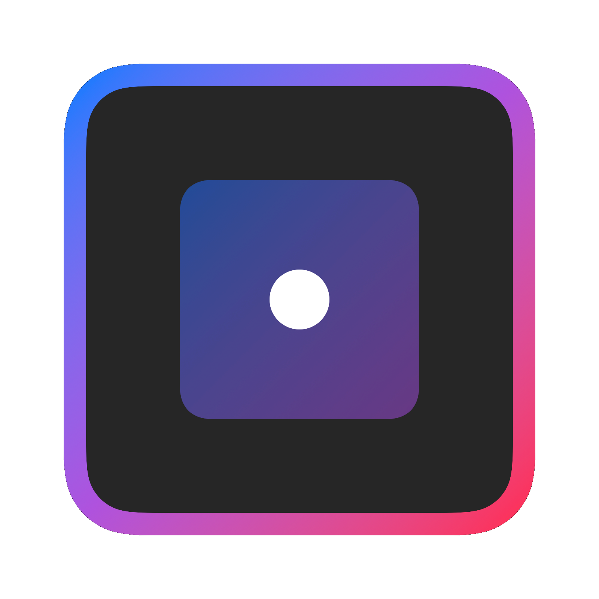
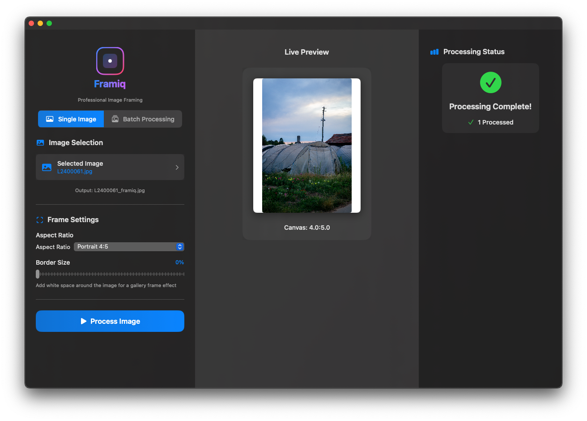

# Framiq - Professional Image Framing Application

<div align="center">
  
  <h3>Transform your images with professional framing and gallery-quality presentation</h3>
  <p>
    
    
    
    
  </p>
</div>

A stunning professional macOS application for intelligent image framing and processing. Transform your images with custom aspect ratios, elegant borders, and gallery-quality presentation. Perfect for photographers, content creators, and social media professionals.

## 📱 Screenshots

<div align="center">
  
  <p><em>Framiq's beautiful interface with real-time preview and batch processing capabilities</em></p>
</div>

## 🎥 Video Demo

<div align="center">
  
docs/assets/Framiq.mp4

  <p><em>🎬 Watch Framiq in action - see the real-time preview and batch processing capabilities!</em></p>
</div>
## 📋 Supported Image Formats

- JPEG (.jpg, .jpeg)
- PNG (.png)
- TIFF (.tiff, .tif)
- HEIC/HEIF (.heic, .heif)
- BMP (.bmp)
- GIF (.gif)

## ✨ Features

### Core Functionality
- 🖼️ **Dual Processing Modes**: Single image or batch processing capabilities
- 📏 **Custom Canvas Sizes**: Choose from popular aspect ratios or set custom dimensions
- 🎨 **Gallery Borders**: Optional white borders (0-50%) for professional passepartout effects
- ⚙️ **Smart Resizing**: Resizes images to fit within chosen canvas while maintaining aspect ratio
- ⚪ **Professional Presentation**: Centers images on clean white backgrounds
- 🔄 **Universal Support**: Processes all image orientations (portrait, landscape, square)

### User Experience
- 🚀 **Real-time Preview**: Live preview updates as you adjust settings
- 📱 **Reactive Interface**: Instant visual feedback for all interactions
- 🎯 **Batch Processing**: Process entire directories with progress tracking
- 📊 **Detailed Results**: Processing summary with completion statistics
- 🎨 **Modern UI**: Beautiful SwiftUI interface with smooth animations

### Technical Excellence
- ⚡ **High Performance**: Asynchronous processing with responsive UI
- 🔍 **Automatic Detection**: Intelligent aspect ratio detection for batch processing
- 📁 **Smart File Handling**: Native macOS file picker integration
- 🛡️ **Robust Error Handling**: Graceful handling of unsupported formats


## 🖥️ System Requirements

- **macOS**: 13.0 (Ventura) or later
- **Development**: Xcode 14.0 or later (for building from source)
- **Architecture**: Universal (Apple Silicon + Intel)

## 🚀 Quick Start

### Download & Install
1. Download the latest release from the [Releases](../../releases) page
2. Extract the `.zip` file and move `Framiq.app` to your Applications folder
3. Launch Framiq from Applications or Spotlight

### First Launch
- macOS may show a security warning - right-click the app and select "Open"
- Grant folder access permissions when prompted for batch processing

## 🏗️ Building from Source

### Option 1: Using Xcode (Recommended)

1. **Clone the project**:
   ```bash
   git clone https://github.com/YOUR_USERNAME/Framiq.git
   cd Framiq
   ```

2. **Open in Xcode**:
   ```bash
   open Framiq.xcodeproj
   ```

3. **Build and run**:
   - Press `Cmd+R` to build and run
   - Or use `Product` → `Run`

### Option 2: Command Line Build

```bash
# Build for release
xcodebuild -project Framiq.xcodeproj -scheme Framiq -configuration Release build

# Locate built app
open build/Release/
```

## 📖 How to Use

### Single Image Mode

1. **Select Mode**: Choose "Single Image" from the mode selector
2. **Choose Image**: Click to select or drag & drop an image file
3. **Configure Settings**:
   - Select aspect ratio (Square, Portrait 4:5, Landscape 3:2, etc.)
   - Set custom dimensions if needed
   - Adjust border percentage (0-50%)
4. **Preview**: See real-time preview of your settings
5. **Process**: Click "Process Image" to create framed version
6. **Result**: Find processed image with `_framiq` suffix in same directory

### Batch Processing Mode

1. **Select Mode**: Choose "Batch Processing" from the mode selector
2. **Input Directory**: Select folder containing your images
3. **Output Directory**: Choose destination for processed images
4. **Auto-Detection**: App automatically detects image aspect ratios
5. **Configure Settings**:
   - Select target aspect ratio for processing
   - Adjust border percentage
   - Preview shows how different image types will look
6. **Process**: Click "Start Processing" to begin batch operation
7. **Monitor**: Watch real-time progress with file-by-file updates
8. **Results**: Review processing summary and find images in output directory

## 🎨 Aspect Ratio Presets

- **Square (1:1)**: Perfect for social media posts
- **Portrait 4:5**: Instagram posts, Pixelfed
- **Portrait 2:3**: Classic photo prints
- **Portrait 3:5**: Tall social media formats  
- **Landscape 5:4**: Horizontal social media
- **Landscape 3:2**: Traditional photography
- **Landscape 16:9**: Widescreen format
- **Story 9:16**: Instagram/TikTok stories
- **Custom Ratio**: Define your own dimensions

## 🔧 Icon Generation

Want to recreate the beautiful Framiq icon? Use the included extraction script:

```bash
# Generate high-resolution PNG icons
swift extract_beautiful_icon.swift

# Creates:
# - BeautifulIcon.png (1600×1600 SwiftUI version)
# - BeautifulIcon_AppKit.png (1024×1024 AppKit version)
```

The script extracts the exact icon rendering code from the app and generates standalone PNG files perfect for use in other applications, websites, or documentation.

## ⚙️ Processing Algorithm

### Canvas Calculation
1. **Base Size**: Uses image's longest dimension as reference
2. **Aspect Fitting**: Calculates canvas size based on chosen aspect ratio
3. **Border Addition**: Applies optional white border (passepartout effect)
4. **Image Fitting**: Scales image to fit within canvas while preserving aspect ratio
5. **Center Positioning**: Places image in center of white canvas

### File Handling
- **Single Mode**: Creates `filename_framiq.ext` in source directory
- **Batch Mode**: Preserves original filenames in destination directory
- **Format Preservation**: Maintains original file format and quality
- **Error Resilience**: Continues processing if individual files fail

## 🏗️ Technical Architecture

### Core Components
- **App.swift**: Application entry point and window configuration
- **ContentView.swift**: Complete UI implementation with reactive components
- **ImageProcessor.swift**: Asynchronous image processing engine
- **extract_beautiful_icon.swift**: Standalone icon generation utility

### Key Technologies
- **SwiftUI**: Modern reactive user interface
- **AppKit**: Native macOS image processing
- **Core Image**: Advanced image manipulation
- **Combine**: Reactive data flow and state management
- **Async/Await**: Non-blocking background processing

### Performance Features
- **Background Processing**: UI remains responsive during batch operations
- **Memory Efficient**: Processes images individually to minimize memory usage
- **Real-time Updates**: Live progress tracking and preview updates
- **Smart Caching**: Optimized image loading and preview generation

## 🔧 Troubleshooting

### Installation Issues
- **Gatekeeper Warning**: Right-click app and select "Open" to bypass
- **Permission Denied**: Check `System Settings` → `Privacy & Security`
- **Architecture Mismatch**: Ensure you're using Universal build

### Runtime Issues
- **Slow Processing**: Large images may take longer; progress bar shows status
- **Memory Warnings**: Process smaller batches for very large image collections
- **File Access**: Grant folder permissions when prompted

### Build Issues
- **Xcode Version**: Ensure Xcode 14.0+ installed
- **Deployment Target**: Verify macOS 13.0+ selected
- **Code Signing**: Configure signing certificate for distribution

## 🗂️ Project Structure

```
Framiq/
├── Framiq.xcodeproj/               # Xcode project configuration
│   ├── project.pbxproj              # Build settings and file references
│   └── xcshareddata/                # Shared schemes and settings
├── Framiq/                         # Source code directory
│   ├── App.swift                    # Application entry point and window setup
│   ├── ContentView.swift            # Complete UI implementation (2000+ lines)
│   ├── ImageProcessor.swift         # Core image processing logic
│   ├── Info.plist                   # App metadata and permissions
│   └── Assets.xcassets/             # App icons and visual assets
├── docs/                            # Documentation and assets
│   ├── assets/                      # Images, icons, and media files
│   │   ├── BeautifulIcon.png        # High-res app icon (1600×1600)
│   │   ├── BeautifulIcon_AppKit.png # Alternative app icon (1024×1024)
│   │   ├── icon.png                 # Original app icon
│   │   ├── Screenshot.png           # Application screenshot
│   │   └── Framiq.mov               # Demo video
│   └── documentation.md             # Comprehensive technical documentation
├── extract_beautiful_icon.swift    # Standalone icon generation utility
├── create_gradient_icon.swift       # Legacy icon creation script
├── create_matching_icon.swift       # Legacy matching icon script
├── generate_icon.swift              # Legacy icon generation script
├── LICENSE                          # MIT License
└── README.md                        # This file
```

## 🚀 Recent Improvements

### Version 1.1 - Enhanced Reactivity
- **Real-time Previews**: Instant updates when adjusting aspect ratios or borders
- **Smooth Animations**: Elegant transitions for all UI interactions
- **Auto-Selection**: Automatic selection of most common aspect ratio in batch mode
- **Consistent Status**: Processing results preserved when switching between modes
- **Performance Optimizations**: Improved memory usage and rendering speed

### Fixed Issues
- ✅ Single image status display now consistently shows completion results
- ✅ Batch preview automatically selects first detected aspect ratio
- ✅ Preview updates in real-time without requiring manual interaction
- ✅ Mode switching preserves completed processing results

## 🤝 Contributing

We welcome contributions! Please see our [Contributing Guidelines](CONTRIBUTING.md) for details.

1. Fork the repository
2. Create a feature branch (`git checkout -b feature/amazing-feature`)
3. Commit your changes (`git commit -m 'Add amazing feature'`)
4. Push to the branch (`git push origin feature/amazing-feature`)
5. Open a Pull Request

## 📄 License

This project is licensed under the MIT License - see the [LICENSE](LICENSE) file for details.

## 🙏 Acknowledgments

- Built with ❤️ using SwiftUI and AppKit
- Inspired by the need for professional image framing tools
- Special thanks to the Swift and macOS developer communities

---

<div align="center">
  <p><strong>Made with ❤️ for photographers, creators, and professionals</strong></p>
  <p>If you find Framiq useful, please consider ⭐ starring the repository!</p>
</div> 